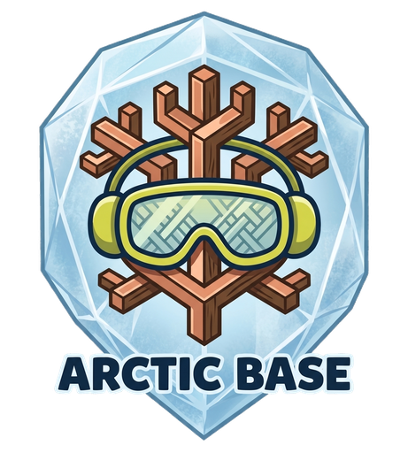
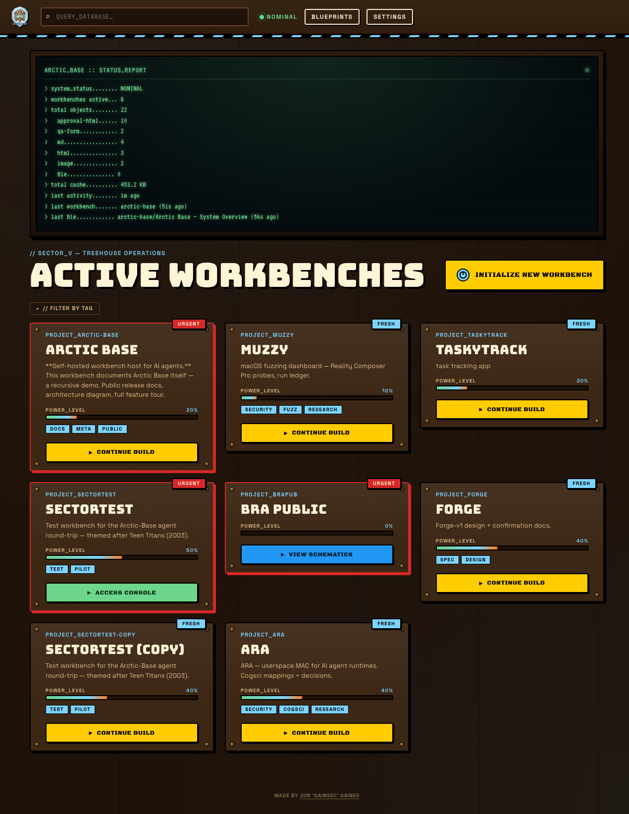
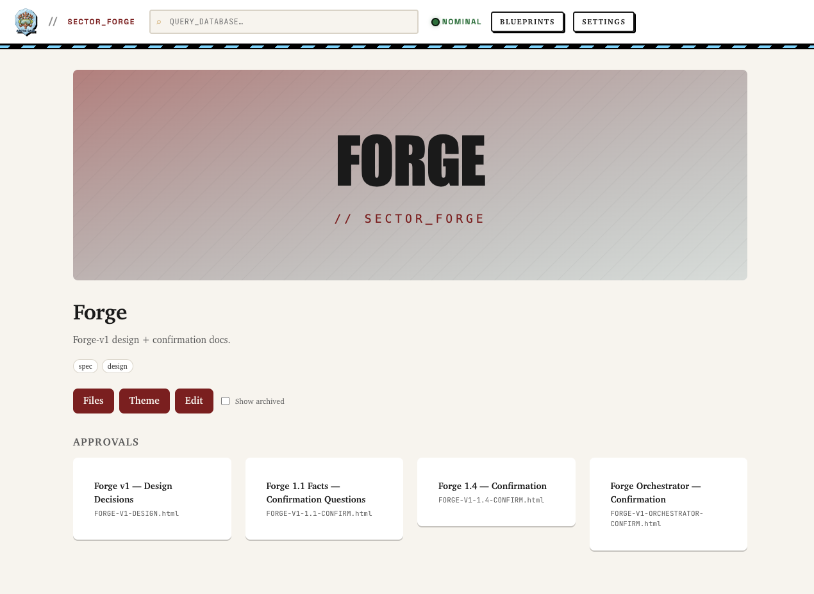
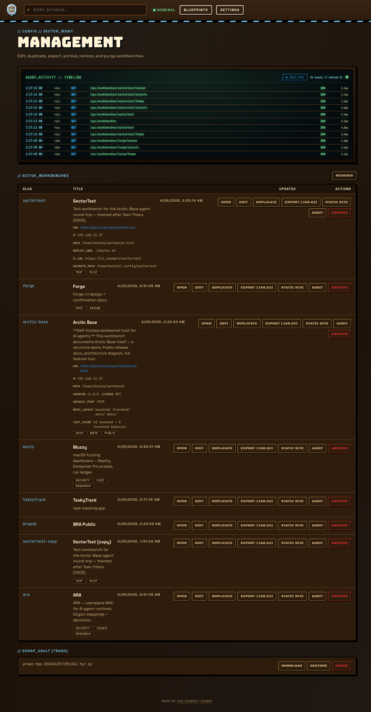
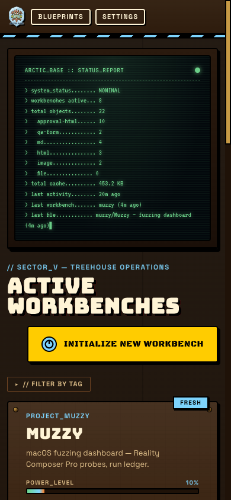
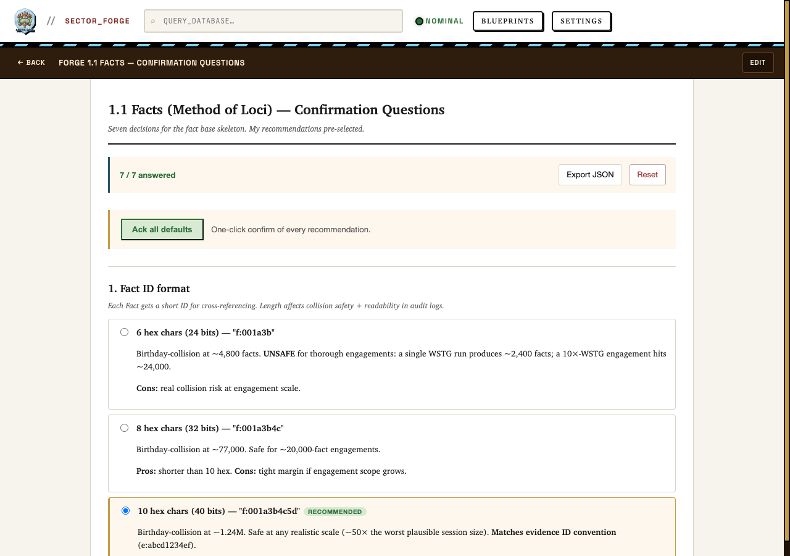
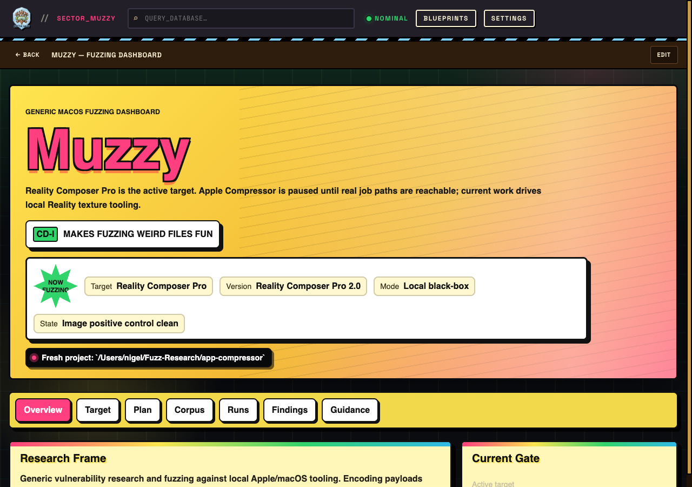

<div align="center">



# Arctic Base

**Self-hosted workbench host for AI agents.**

A single place per project where your AI coding agent can drop approval forms,
share files both ways, render markdown for review, drive a persistent
task list, and wait for you to respond — without bloating your chat context or
forcing you to copy-paste.

[Quick start](#quick-start) · [Why](#why) · [Agent integration](#agent-integration) ·
[Object kinds](#object-kinds) · [Templates](#html--runbook-templates) ·
[Theming](#theming) · [API](#api-surface) · [Docker](#docker) · [License](#license)

**📖 [Live system overview](docs/index.html)** — single-page tour of what Arctic Base is, the architecture, the 7 object kinds, and the agent surface. Best viewed via GitHub Pages or after cloning.

</div>

## Screenshots

<table>
<tr>
<td width="50%">

**Top-level dashboard** (KND chrome)



</td>
<td width="50%">

**Per-workbench dashboard** (Forge · parchment + Charter serif theme · floating cards · burgundy accents)



</td>
</tr>
<tr>
<td width="50%">

**Management page** (activity timeline · self-test · per-workbench actions)



</td>
<td width="50%">

**Mobile** (topnav collapses to logo + buttons · single-column grid)



</td>
</tr>
</table>

More: [`docs/screenshots/`](docs/screenshots/) including a parchment-themed
workbench, the visual architecture docs, and the mobile management view.

### What an agent-authored object looks like

Every workbench gets its own themed dashboard plus any number of HTML / MD
objects the agent uploads. The agent writes the HTML; Arctic Base hosts it
and re-themes it via `--wb-*` tokens. Two real examples from the demo data:

<table>
<tr>
<td width="50%">

**Forge · approval-questions form**

Spawned from the `approval-questions` template — seven decisions, each with
options + recommendation + notes. User clicks through; agent reads answers
via `/responses/latest/payload`. Parchment + Charter serif theme.



</td>
<td width="50%">

**Muzzy · custom fuzzing dashboard**

A self-authored HTML object (no template) — current target, run ledger,
corpus plan, findings, guidance. Demonstrates that the same surface scales
from "fill in a template" to "agent ships a bespoke single-page app." Hot
pink + lemon CD-i theme.



</td>
</tr>
</table>

---

## Why

LLM coding agents need *out-of-band* surfaces for:

- **Decisions you don't want in chat** — five architecture questions with
  recommendations, options, and notes; the agent picks them up structured.
- **File handoff in either direction** — drop a binary, an image, a CSV, a log;
  pick it up later.
- **Document review** — long markdown the agent wrote, rendered in your theme.
- **Async signaling** — an HTML form the agent generates that you fill out at
  your pace, the agent polls and reads when you submit.
- **Long-running task plans** — a structured runbook the agent reads + writes
  across sessions; you tick checkboxes and add blockers from the browser.

Pasting forty-line approval questions into a chat thread bloats context, hides
the canonical artifact, and makes audit trails impossible. Arctic Base gives
the agent an HTTP API to publish those artifacts and a web UI for you to
respond. Each project gets a themed *workbench* — its own dashboard,
look, and metadata.

It's also self-hosted, single-user, no auth — designed for LAN / Tailscale,
not the public internet.

## Features

**Agent surface**
- **Agent-first API** — OpenAPI at `/openapi.json`, conventions doc at `/api/agent/conventions`, one-shot bootstrap, CLAUDE.md memory snippets, self-test, activity log.
- **Self-contained HTML / runbook templates** — `approval-questions`, `qa-form`, `pitch`, `runbook`. Each works standalone (localStorage + JSON export) or wired through Arctic Base.
- **`window.workbench` JS bridge** — feature-detected; agent-authored HTML stays portable. Save / submit / load / `onRemoteChange` all wired.

**Workbenches**
- **Per-workbench theming** — colors, typography, spacing, *and* layout composition (corners / shadow / cards / banner shape / motif / density). Same Svelte template renders five visibly different workbenches.
- **Auto-themed banners** — every workbench has one; SVG generated from theme tokens if none uploaded.
- **Custom metadata fields** — `deploy_cmd`, `ci_url`, `secrets_path`, etc. Agents see them in the manifest.
- **Trash / restore / export / duplicate** — per-workbench tar.gz archive, soft-delete, deep-clone.

**Object lifecycle**
- **Pin + archive** per object — sticks to top of drawer / hide-but-restorable.
- **Image paste / drag-drop** in the editor — uploaded as a `kind: image` object, link inserted at cursor.
- **Snapshots** — labelled tar.gz checkpoints. List, download, restore-to-new-workbench, delete.
- **Audit log** — chronological NDJSON of every content-level mutation, downloadable per workbench.
- **Static-site export** — self-contained zip of a workbench (rendered MD, themed HTML, images, theme CSS, index page) — host anywhere without Arctic Base running.

**Operations & UI**
- **Live activity timeline** — every API request lands in an in-memory ring buffer surfaced as a green-CRT terminal.
- **Drag-free reorder** — ▲/▼ controls for workbenches + per-workbench objects, persistent server-side.
- **Code-split frontend** — initial bundle ~78 KB gzipped; CodeMirror 6 lazy-loaded.
- **Offline / self-contained** — fonts bundled via `@fontsource/*`. No CDN at runtime; the SPA boots on a LAN with no internet.

## Quick start

Requires Python 3.12+ with [`uv`](https://docs.astral.sh/uv/) and Node 20+
with [`pnpm`](https://pnpm.io/).

```sh
git clone https://github.com/GainSec/ArcticBase.git && cd arctic-base
make sync           # install backend + frontend deps
make build          # build the SPA
make backend-run    # binds 0.0.0.0:2929 by default
```

Open <http://localhost:2929>. To develop the frontend with hot reload, run
`make backend-dev` and `make frontend-dev` in two terminals — the dev server
proxies API calls.

## Agent integration

Hand any AI coding agent a single URL:

```
https://your-arctic-base/agent
```

That URL 302s to `/openapi.json`. From the conventions doc and the templates
endpoint, the agent figures out the rest:

```text
agent → GET /agent                                    (302 → /openapi.json)
agent → GET /api/agent/conventions                    (≈10 KB runbook)
agent → POST /api/agent/self-test                     (1-call sanity check)
agent → POST /api/agent/bootstrap {project_title}     (creates workbench)
agent → GET /api/agent/templates                      (lists 4 templates)
agent → GET /api/agent/templates/approval-questions?fill_title=…
agent → edit QS array, upload as kind=approval-html
       → POST /api/workbenches/{slug}/objects (multipart)
agent → poll /responses?since_version=N every 2-5s
user  → opens workbench in browser, fills form, submits
agent → reads back via /responses/latest/payload
```

The conventions doc covers what OpenAPI can't express: the
`window.workbench` runtime, polling cadence, theme contract, review-HTML
discipline, the templates-first authoring rule, runbook semantics,
pin/archive conventions, snapshots/audit/static-export usage.

Drop a CLAUDE.md / AGENTS.md fragment into your project so future sessions
auto-discover the workbench:

```sh
curl -s "$URL/api/agent/claude-md-snippet?slug=$SLUG&format=claude" >> CLAUDE.md
```

## Object kinds

| Kind | What it is |
|---|---|
| `md` | Markdown doc, rendered in browser with theme tokens (task-list checkboxes supported). |
| `html` | Self-contained HTML the agent authors. Theme + bridge auto-injected. |
| `approval-html` | Same as `html` but filed under "Approvals". The decision-doc pattern. |
| `qa-form` | Short ad-hoc Q&A form. Lighter than approval-html. |
| `runbook` | Persistent JSON task list (steps, status, blockers, timestamps). Agent reads + writes; user ticks/unticks. |
| `image` | Image to view in browser. Paste/drop into the editor uploads as this kind. |
| `file` | Generic binary / catch-all. |

Every kind supports `pinned: bool` (sticks to top of its drawer) and
`archived: bool` (hidden from default lists, recoverable). Default
`list_objects` excludes archived; pass `?include_archived=true` for the
full inventory.

## HTML / runbook templates

Four out-of-the-box, all self-contained:

| Template | Use for | API kind |
|---|---|---|
| `approval-questions` | Multi-decision review with options + recommendations + notes | `approval-html` |
| `qa-form` | Quick free-form Q&A (text / textarea / choice) | `qa-form` |
| `pitch` | Narrative + Approve / Defer / Reject footer | `approval-html` |
| `runbook` | Persistent JSON task list with status + blockers | `runbook` |

Templates reference `--wb-*` CSS variables so they auto-theme when served via
Arctic Base, and bake in fallback values so they still work opened standalone.
JSON export, localStorage cache, and `window.workbench.submit()` mirror to the
API are all wired. Don't hand-write from scratch — fetch a template, edit the
clearly-labelled `QS` array (or `<section>` block for pitch, `steps` array
for runbook), upload.

## Theming

Each workbench has a `theme.md` with YAML frontmatter (machine-readable) +
Markdown prose body (brand voice / component metaphors). Required `core`
tokens validated server-side: `bg`, `surface`, `ink`, `muted`, `rule`,
`accent`, `accent-2`, `success`, `error`. Plus `typography.body` &
`typography.mono`, `rounded.{sm,md,lg}`, `spacing.{unit,gutter,margin}`. A
freeform `custom: {}` map allows per-workbench extras
(`--wb-pink-pop`, `--wb-xenothium`, etc.).

Optional `layout:` block drives composition, not just color:

```yaml
layout:
  density:      compact | comfortable | spacious
  corners:      sharp | soft | rounded | full
  shadow:       hard-offset | soft | glow | none
  card-style:   bolted | flat | floating | inset
  motif:        bolts | hex | tape | none
  banner-shape: rect | t-shape | circle | none
  hero-style:   cover | flat | crt-monitor | none
```

Same Svelte template, different feel: a "bolted-with-hard-offset-shadow-and-tape"
workbench reads as brutalist arcade; a "floating-soft-rounded-with-hex-motif"
reads as TCG codex. Both consume the same React-equivalent component.

## Architecture

```
        ┌──────────────────────────────────────────────┐
agent ─▶│  /api/* (FastAPI)                            │
        │                                              │
        │  /agent  /api/agent/conventions              │
        │  /api/agent/bootstrap  /api/agent/templates  │
        │  /api/agent/activity  /api/agent/self-test   │
        │                                              │
        │  /api/workbenches[/{slug}[/...]]             │
        │  /api/workbenches/{slug}/objects[/{id}]      │
        │  /api/workbenches/{slug}/objects/{id}/       │
        │      content / render / responses            │
        │  /api/workbenches/{slug}/snapshot[s]         │
        │  /api/workbenches/{slug}/audit               │
        │  /api/workbenches/{slug}/static-export       │
        │                                              │
        │  Storage  →  data/workbenches/{slug}/...     │
        │              (flat files; SQLite-swappable   │
        │               behind the Storage interface)  │
        └──────────────────────────────────────────────┘
                              ▲
                              │ same origin
                              ▼
        ┌──────────────────────────────────────────────┐
user  ─▶│  / (Svelte SPA)                              │
        │                                              │
        │  Top-level: KND-themed dashboard,            │
        │             status console, topnav with      │
        │             logo + Blueprints + Settings     │
        │  Per-workbench: workbench-themed dashboard,  │
        │                 themed iframes for served    │
        │                 HTML, MD render, runbook,    │
        │                 image view                   │
        │                                              │
        │  window.workbench bridge ↔ iframe postMessage│
        └──────────────────────────────────────────────┘
```

- **Backend:** FastAPI + Pydantic 2 + uvicorn. Single static binary deploy
  via `uv run arctic-base`. JSON logs to stdout; per-request `X-Request-ID`.
  Storage is filesystem-only in v1, hidden behind a `Storage` Protocol so
  SQLite or hybrid can drop in later.
- **Frontend:** Svelte 5 + Vite 8, single SPA. Code-split: initial bundle
  ~58 KB, CodeMirror lazy chunk only loads on `/edit` / `/theme`. No CSS
  framework — just CSS custom properties + scoped styles.
- **State:** flat files. One directory per workbench. Each object is a
  directory with `meta.json` + raw `content`. Responses are append-only
  versioned JSON files. Trash is a `tar.gz` per archived workbench. Snapshots
  are labelled tar.gz under `data/snapshots/{slug}/`. Audit log is
  `data/workbenches/{slug}/audit.jsonl`.

## API surface

Full machine-readable spec at `/openapi.json`. In-browser explorer at `/docs`.

<details>
<summary>Click to expand the endpoint list</summary>

```
# Workbenches
POST   /api/workbenches                         create workbench
GET    /api/workbenches                         list (last_accessed, then manual order)
GET    /api/workbenches/{slug}                  read manifest + bump last_accessed
PATCH  /api/workbenches/{slug}                  update mutable fields (incl custom_fields)
POST   /api/workbenches/{slug}/duplicate        clone (responses reset)
DELETE /api/workbenches/{slug}                  archive to trash
POST   /api/workbenches/_reorder                manual sort override

# Workbench operations
GET    /api/workbenches/{slug}/banner           PNG/SVG (auto-generated if none)
GET    /api/workbenches/{slug}/export           tar.gz download
GET    /api/workbenches/{slug}/static-export    self-contained zip
GET    /api/workbenches/{slug}/audit            NDJSON audit log
POST   /api/workbenches/{slug}/snapshot         labelled checkpoint
GET    /api/workbenches/{slug}/snapshots        list
GET    /api/workbenches/{slug}/snapshots/{n}/download
POST   /api/workbenches/{slug}/snapshots/{n}/restore   body: {new_slug}
DELETE /api/workbenches/{slug}/snapshots/{n}    permanently delete one

# Theme
GET    /api/workbenches/{slug}/theme            parsed tokens + prose
PUT    /api/workbenches/{slug}/theme            replace theme.md
PUT    /api/workbenches/{slug}/theme/assets/{path}     upload asset

# Objects
POST   /api/workbenches/{slug}/objects          create (JSON or multipart)
GET    /api/workbenches/{slug}/objects[/{id}]   list / read
PATCH  /api/workbenches/{slug}/objects/{id}     update meta (pinned, archived, etc.)
PUT    /api/workbenches/{slug}/objects/{id}/content    write (If-Match for stale-check)
GET    /api/workbenches/{slug}/objects/{id}/render     themed render (md / html / image / file / runbook)
DELETE /api/workbenches/{slug}/objects/{id}     hard-delete
POST   /api/workbenches/{slug}/objects/_reorder ids = [...]

# Responses
POST   /api/workbenches/{slug}/objects/{id}/responses        append event
GET    /api/workbenches/{slug}/objects/{id}/responses?since_version=N
GET    /api/workbenches/{slug}/objects/{id}/responses/latest/payload   bare JSON
GET    /api/workbenches/{slug}/objects/{id}/responses/export           full history download

# Agent
GET    /agent                                   302 → /openapi.json
GET    /api/agent/conventions                   ≈10 KB runbook
GET    /api/agent/templates[/{id}]              list + fetch (?fill_title=)
POST   /api/agent/bootstrap                     create + checklist
GET    /api/agent/claude-md-snippet?slug=...    paste-ready memory snippet
GET    /api/agent/activity                      recent request log
POST   /api/agent/self-test                     synthetic round-trip
```

</details>

## Configuration

All env-var driven; defaults shown.

| Variable | Default | Purpose |
|---|---|---|
| `ARCTIC_BASE_DATA` | `./data` | Where workbench data lives |
| `ARCTIC_BASE_HOST` | `0.0.0.0` | Listen address |
| `ARCTIC_BASE_PORT` | `2929` | Listen port |
| `ARCTIC_BASE_MAX_UPLOAD_BYTES` | `2147483648` (2 GB) | Per-upload cap |
| `ARCTIC_BASE_FRONTEND_DIST` | `../frontend/dist` | Built SPA path |

Copy `.env.example` to `.env` and edit if you want.

## Docker

```sh
docker build -t arctic-base .
docker run -d --name arctic-base \
  -p 2929:2929 \
  -v $PWD/data:/data \
  arctic-base
```

Multi-stage build: SPA built with Node, served from a Python runtime image.
State lives in the `/data` volume.

## Project layout

```
backend/      FastAPI app (Python 3.12+, uv-managed)
  src/arctic_base/      package source
  tests/                pytest test suite (68 tests)
frontend/     Vite + Svelte 5 + TypeScript SPA (pnpm)
  src/lib/chrome/       Arctic Base shell components
  src/lib/themed/       per-workbench themed components
data/         workbench data (gitignored)
docs/         design specs and implementation plans
```

## Tests

```sh
make test
```

Runs `pytest` against the backend (68 tests; storage round-trip, API contract,
agent endpoints, templates, layout tokens, render flows, snapshots, audit log,
static export, self-test, runbook kind, pin/archive) and `svelte-check`
against the frontend (TypeScript + Svelte).

## What it is *not*

To be honest about scope:

- **Not multi-tenant.** Single user. No auth. Trust the network behind a
  reverse proxy (Caddy / Tailscale / WireGuard).
- **Not real-time.** Polling-only in v1 (`?since_version=N`); endpoints are
  shaped to upgrade to long-poll / SSE without API churn.
- **Not a sandbox.** It runs on your machine and accepts agent-authored
  HTML. The HTML is iframe-isolated but the host process is yours.
- **Not a backup service.** Use `/export`, `/snapshot`, and the trash
  tar.gz; or the data directory is just a directory you can `tar` and rsync.

## License

[MIT](./LICENSE).

## Authors

[Jon 'GainSec' Gaines](https://gainsec.com/)
